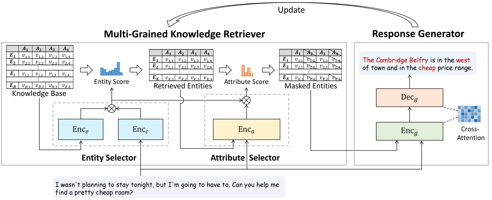

# Multi-Grained Knowledge Retrieval for End-to-End Task-Oriented Dialog

Fanqi Wan, Weizhou Shen, Ke Yang, Xiaojun Quan*, Wei Bi*

*: Co-corresponding Authors


This is a repo of the official source code of [Multi-Grained Knowledge Retrieval for End-to-End Task-Oriented Dialog](https://arxiv.org/abs/2305.10149), a paper in **ACL 2023**. The repo contains the code and dataset for training and evaluation.

## Quick Links

- [Overview](#overview)
- [Model List](#model-list)
- [Requirements](#requirements)
- [Description of Codes](#description-of-codes)
- [How to Run](#how-to-run)
  - [Preparation](#preparation)
  - [Retriever Pretraining](#retriever-pretraining)
  - [System Training](#system-training)
- [Citation](#citation)

## Overview

We propose a framework for end-to-end task oriented dialog that decouple knowledge retrieval from response generation and introduce a multi-grained knowledge retriever (MAKER) that includes an entity selector to search for relevant entities and an attribute selector to filter out irrelevant attributes. To train the retriever, we propose a novel distillation objective that derives supervision signals from the response generator. The following figure is an illustration of our whole framework.

<p align="center">
     <br>
</p>

## Model List
Our released models are listed as following.

|              Model              | BLEU | Entity F1 |
|:-------------------------------|:--------:|:--------:|
|  [MAKER-mwoz-condensed-kb-t5-base](https://huggingface.co/Wanfq/MAKER-mwoz-condensed-kb-t5-base) |   17.23 |   53.68 |
| [MAKER-mwoz-condensed-kb-t5-large](https://huggingface.co/Wanfq/MAKER-mwoz-condensed-kb-t5-large) |   18.77  |   54.72  |
|    [MAKER-smd-condensed-kb-t5-base](https://huggingface.co/Wanfq/MAKER-smd-condensed-kb-t5-base)    |   24.79  |   69.79  |
|    [MAKER-smd-condensed-kb-t5-large](https://huggingface.co/Wanfq/MAKER-smd-condensed-kb-t5-large)  |   25.91  |   71.30  |
|   [MAKER-camrest-condensed-kb-t5-base](https://huggingface.co/Wanfq/MAKER-camrest-condensed-kb-t5-base)|   25.04  |   73.09  |
|  [MAKER-camrest-condensed-kb-t5-large](https://huggingface.co/Wanfq/MAKER-camrest-condensed-kb-t5-large)  |   25.53  |   74.36  |
|     [MAKER-mwoz-full-kb-t5-base](https://huggingface.co/Wanfq/MAKER-mwoz-full-kb-t5-base)     |   16.25  |   50.87  |
|     [MAKER-mwoz-full-kb-t5-large](https://huggingface.co/Wanfq/MAKER-mwoz-full-kb-t5-large)     |   18.23  |   52.12  |
|     [MAKER-camrest-full-kb-t5-base](https://huggingface.co/Wanfq/MAKER-smd-condensed-kb-t5-base)     |   26.19  |   72.09  |
|     [MAKER-camrest-full-kb-t5-large](https://huggingface.co/Wanfq/MAKER-smd-condensed-kb-t5-large)     |   25.34  |   72.43  |

You could download these models and use the corresponding test scripts to get evaluation results. Here is an example:
```
# Test 'MAKER-mwoz-condensed-kb-t5-base', use 'run_test_condensed_mwoz_base.sh'. Please run this after **Preparation**.
#!/bin/bash

export CUDA_VISIBLE_DEVICES=0
ES=48000
DATA=RRG_data1_times_gtdb_gesa_times-cr-dyn
RMN=others/models/RRG/retriever_train_new_trunc_data_used_new_v0_seed-111_bert-base-uncased_ep-10_lr-5e-5_wd-0.01_maxlen-128_bs-32_ngpu-4_pln-128_tmp-0.05_hnw-0
python test.py \
    --per_gpu_eval_batch_size 32 \
    --model_size base \
    --dataset_name mwoz_gptke \
    --metric_version new1 \
    --retriever_model_name ${RMN} \
    --test_data others/data/mwoz_gptke/data_used/${DATA}/test.json \
    --dbs others/data/mwoz_gptke/data_used/${DATA}/all_db.json \
    --test_model_path DOWNLOAD_PATH/MAKER-mwoz-condensed-kb-t5-base/generator_best_dev \
    --use_ranker True \
    --rank_attribute_start_step 0 \
    --rank_attribute_pooling avg_wo_context \
    --ranker_attribute_ways threshold \
    --threshold_attr 0.1 \
    --ranker_times_matrix True \
    --ranker_times_matrix_start_step 0 \
    --ranker_times_matrix_loss_type bce \
    --ranker_times_matrix_query cr \
    --generator_distill_retriever True \
    --generator_distill_retriever_start_step 20000 \
    --use_delex True \
    --use_dk True \
    --dk_mask True \
    --end_eval_step ${ES} \
    --use_gt_dbs True \
    --use_retriever_for_gt True \
    --top_k_dbs 6 \
    "$@"
```

## Requirements
```
# Retriever Pretraining
apex == 0.9.10dev
datasets == 2.0.0
deepspeed == 0.6.0
fairscale == 0.4.6
filelock == 3.6.0
packaging == 21.3
scikit-learn == 1.0.2
torch == 1.8.1
transformers == 4.17.0
```
```
# System Training
dataclasses == 0.8
filelock == 3.4.1
nltk == 3.6.7
packaging == 21.3
tensorboard == 2.9.1
torch == 1.8.1
transformers ==  3.0.2
```


## Description of Codes

`./retriever_pretraining` -> directories for the retriever pretraining codes.

`./system_training` -> directories for the system training codes.


## How to run

### Preparation

Please download from [this link](https://drive.google.com/file/d/1VIJOV7B0l3d2kVmR8Hnj9lsJmF7rLBfz/view?usp=sharing) for **all datasets** and **pretrained retriever models**. Then unzip the file and place the `preparation/retriever_pretraining/others` in codes `./retriever_pretraining/`and place the `preparation/system_training/others` in codes `./system_training/` .

Tips: For the MWOZ dataset, some of its domains need booking reference numbers which should be related to the dialogs and obtained by real-time queries to restaurants or hotels. Therefore, booking reference numbers have to be decoupled from the knowledge base. Following previous work (GPT-KE, ECO), we decouple the reference numbers from the knowledge base by inserting dialogue turns that simulate real-time querying reference numbers.

### Retriever Pretraining

We provide pretrained retriever models in **Preparation**, so you can skip this section if you do not want to retrain.

```
conda activate retriever_pretraining_env
cd retriever_pretraining
```

#### MWOZ

```
bash run_sup_example_mwoz_gptke.sh
```

#### CamRest

```
bash run_sup_example_camrest.sh
```

When training is completed, replace the corresponding models (with the same file name) in **Preparation** with the trained models.

### System Training

Please run this after **Preparation**.

```
conda activate system_training_env
cd system_training
```

#### MWOZ

For the **condensed knowledge base** of MWOZ, we provide **t5-base** and **t5-large** training and testing scripts.

```
# condensed knowledge base -- t5-base
bash run_train_condensed_mwoz_base.sh
bash run_test_condensed_mwoz_base.sh

# condensed knowledge base -- t5-large
bash run_train_condensed_mwoz_large.sh
bash run_test_condensed_mwoz_large.sh
```

For the **full knowledge base** of MWOZ, we provide **t5-base** and **t5-large** training and testing scripts.

```
# full knowledge base -- t5-base
bash run_train_full_mwoz_base.sh
bash run_test_full_mwoz_base.sh

# full knowledge base -- t5-large
bash run_train_full_mwoz_large.sh
bash run_test_full_mwoz_large.sh
```

#### SMD

For the **condensed knowledge base** of SMD, we provide **t5-base** and **t5-large** training and testing scripts.

```
# condensed knowledge base -- t5-base
bash run_train_condensed_smd_base.sh
bash run_test_condensed_smd_base.sh

# condensed knowledge base -- t5-large
bash run_train_condensed_smd_large.sh
bash run_test_condensed_smd_large.sh
```

#### CamRest

For the **condensed knowledge base** of CamRest, we provide **t5-base** and **t5-large** training and testing scripts.

```
# condensed knowledge base -- t5-base
bash run_train_condensed_camrest_base.sh
bash run_test_condensed_camrest_base.sh

# condensed knowledge base -- t5-large
bash run_train_condensed_camrest_large.sh
bash run_test_condensed_camrest_large.sh
```

For the **full knowledge base** of CamRest, we provide **t5-base** and **t5-large** training and testing scripts.

```
# full knowledge base -- t5-base
bash run_train_full_camrest_base.sh
bash run_test_full_camrest_base.sh

# full knowledge base -- t5-large
bash run_train_full_camrest_large.sh
bash run_test_full_camrest_large.sh
```

## Citation

Please cite our paper if you use MAKER in your work:

```bibtex
@article{wan2023multi,
  title={Multi-Grained Knowledge Retrieval for End-to-End Task-Oriented Dialog},
  author={Wan, Fanqi and Shen, Weizhou and Yang, Ke and Quan, Xiaojun and Bi, Wei},
  journal={arXiv preprint arXiv:2305.10149},
  year={2023}
}
